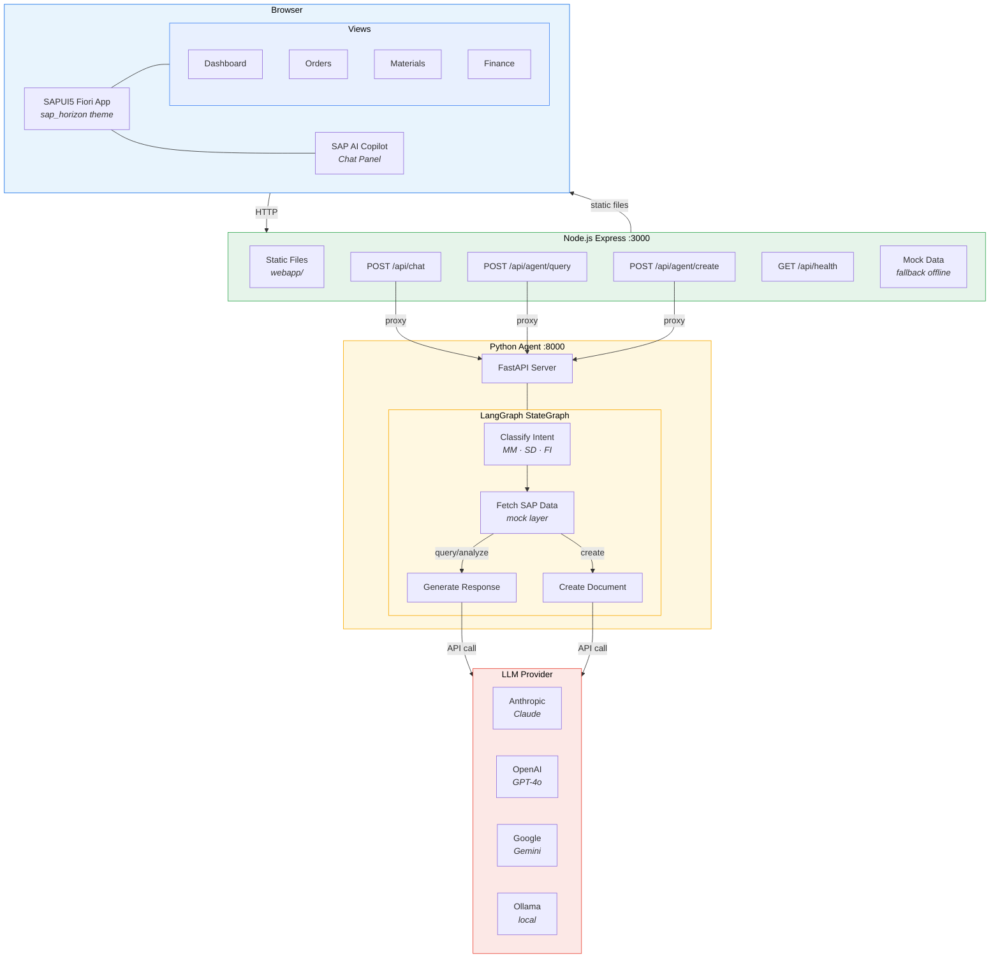
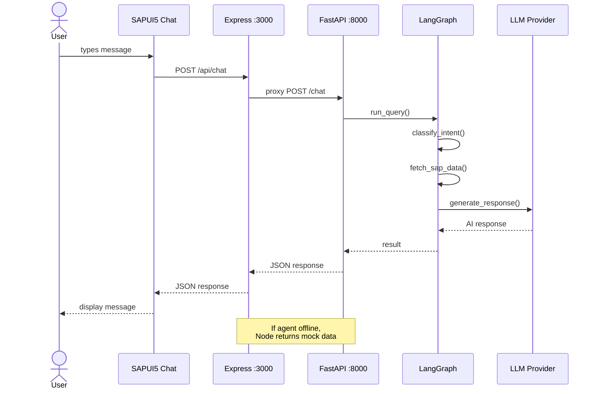

# SAPCopilotForge

An intelligent SAP ERP assistant with a built-in AI agent. The application combines a SAP Fiori interface with a conversational AI panel (SAP AI Copilot) that allows users to query SAP data using natural language — purchase orders, materials, finances and invoices.

The AI agent analyzes user queries, classifies the relevant SAP module (MM, SD, FI), fetches the appropriate data and generates clear responses in Polish.

## Screenshots

### Dashboard with AI Copilot panel


### AI agent conversation


## Tech Stack

| Layer | Technology |
|---|---|
| **Frontend** | SAPUI5 / OpenUI5 (sap_horizon theme, Fiori design) |
| **Backend** | Node.js + Express 5 |
| **AI Agent** | Python + LangGraph + LangChain |
| **LLM** | Multi-provider: Anthropic, OpenAI, Google Gemini, Ollama |
| **Agent API** | FastAPI + Uvicorn |

### Frontend — SAPUI5 Fiori
- Native SAP Fiori interface built on **OpenUI5** (CDN)
- **sap_horizon** theme — SAP's latest design system
- Views: Dashboard, Orders, Materials, Finance
- Built-in **SAP AI Copilot** panel — chat with the AI agent directly in the UI
- Natural language navigation from the chat (e.g. *"show orders"*)
- Edit & resend previous messages in the chat
- Full i18n support (Polish)
- Components: `tnt:ToolPage`, `SplitApp`, `GenericTile`, `IconTabBar`, `Table`

### Backend — Node.js Express
- **Express 5** server serving static SAPUI5 files
- API proxy forwarding requests to the Python agent
- CORS support and global error handling
- Endpoints: `/api/chat`, `/api/agent/query`, `/api/agent/create`, `/api/health`
- Automatic fallback to mock data when the agent is offline

### AI Agent — Python LangGraph
- **LangGraph** state graph with stages: intent classification → SAP data retrieval → response generation
- **Multi-provider LLM** — switch between providers with a single env variable
- **FastAPI** server with REST endpoints
- SAP module support: **MM** (purchasing/materials), **SD** (sales), **FI** (finance)
- Mock data layer simulating SAP system responses

## Supported LLM Providers

| Provider | `LLM_PROVIDER` | API Key Variable | Default Model | Install |
|---|---|---|---|---|
| **Anthropic** | `anthropic` | `ANTHROPIC_API_KEY` | claude-sonnet-4-20250514 | included |
| **OpenAI** | `openai` | `OPENAI_API_KEY` | gpt-4o | included |
| **Google Gemini** | `google` | `GOOGLE_API_KEY` | gemini-2.0-flash | `pip install langchain-google-genai` |
| **Ollama** (local) | `ollama` | — (free) | llama3.1 | `pip install langchain-ollama` |

If `LLM_PROVIDER` is not set, the agent auto-detects the provider based on which API key is available.

You can override the model with `LLM_MODEL` in `.env.local`.

## Requirements

- **Node.js** >= 18
- **Python** >= 3.10
- **LLM API key** — at least one of: [Anthropic](https://console.anthropic.com/), [OpenAI](https://platform.openai.com/), [Google](https://aistudio.google.com/), or local [Ollama](https://ollama.com/)

## Installation

### 1. Node.js dependencies

```bash
npm install
```

### 2. Python dependencies (AI agent)

```bash
npm run agent:install
```

### 3. LLM configuration

Copy the example and edit `.env.local`:

```bash
cp .env.example .env.local
```

**Anthropic (default):**
```env
ANTHROPIC_API_KEY=sk-ant-YOUR_KEY
```

**OpenAI:**
```env
LLM_PROVIDER=openai
OPENAI_API_KEY=sk-YOUR_KEY
```

**Google Gemini:**
```env
LLM_PROVIDER=google
GOOGLE_API_KEY=YOUR_KEY
```

**Ollama (free, local):**
```env
LLM_PROVIDER=ollama
LLM_MODEL=llama3.1
```

## Running

You need **two terminals** running simultaneously:

### Terminal 1 — Node.js server (port 3000)

```bash
npm run dev
```

### Terminal 2 — Python AI agent (port 8000)

```bash
npm run agent:start
```

The application is available at: **http://localhost:3000**

## Commands

| Command | Description |
|---|---|
| `npm run dev` | Node.js server with auto-reload |
| `npm run start` | Node.js server (production) |
| `npm run agent:start` | Python AI agent (LangGraph) |
| `npm run agent:install` | Install Python dependencies |

## Architecture



### Request Flow



## Troubleshooting

**"Cannot connect to AI agent"**
- Make sure the Python agent is running (`npm run agent:start`)
- Check that your API key is set in `.env.local`

**Agent won't start**
- Install dependencies: `npm run agent:install`
- Check Python version: `python --version` (requires >= 3.10)

**Wrong LLM provider**
- Check active provider: `curl http://localhost:8000/health`
- Set `LLM_PROVIDER` explicitly in `.env.local`

**Application doesn't load in browser**
- Make sure the Node.js server is running (`npm run dev`)
- Open http://localhost:3000
